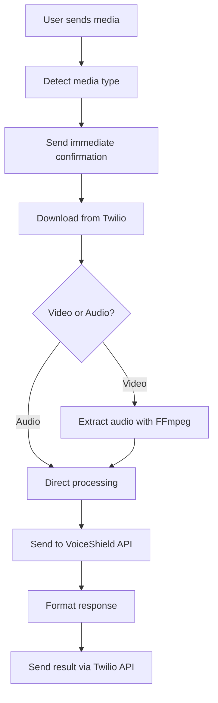

# VoiceShield WhatsApp Integration

This module integrates VoiceShield AI with WhatsApp through Twilio's API, providing real-time voice authenticity analysis for both audio and video messages.

## 🎯 Features

- **Audio Analysis**: Direct analysis of voice messages
- **Video Support**: Automatic audio extraction from video files  
- **Dual-Message System**: Immediate confirmation + detailed results
- **Smart Segmentation**: Handles long audio files efficiently
- **Real-time Processing**: Fast analysis with user feedback
- **Error Handling**: Comprehensive error management and user guidance

## 📱 User Experience

### Audio Messages
1. **Immediate Response**: "🎤 Audio received! Analyzing with AI... ⏳"
2. **Background Processing**: Audio analysis with VoiceShield AI
3. **Result Delivery**: "🎤 *Audio Analysis Complete* ✅ *Result: REAL*"

### Video Messages  
1. **Immediate Response**: "🎥 Video received! Extracting audio and analyzing... This may take a few moments ⏳"
2. **Background Processing**: Audio extraction + VoiceShield analysis
3. **Result Delivery**: "🎥 *Video Audio Analysis Complete* ✅ *Result: REAL*"

## 🔧 Technical Implementation

### Dual-Message Architecture
```python
# Orchestrator sends immediate confirmation via Twilio API
send_whatsapp_message(to_number=user_number, message_body=confirmation_msg)

# Webhook returns empty TwiML response
resp = MessagingResponse()  # Empty response

# Final result delivery also via Twilio API
send_whatsapp_message(to_number=user_number, message_body=analysis_result)
```

### Video Processing Pipeline
```
Video File → Audio Extraction (FFmpeg) → VoiceShield Analysis → Result
```

### Supported Formats
- **Audio**: MP3, WAV, M4A, OGG, FLAC
- **Video**: MP4, 3GP, MOV, AVI (audio extracted automatically)

## 🚀 Quick Start

1. **Environment Setup**:
```bash
export TWILIO_ACCOUNT_SID="your_account_sid"
export TWILIO_AUTH_TOKEN="your_auth_token"
export WEBHOOK_URL="https://your-domain.com"
```

2. **Install Dependencies**:
```bash
pip install fastapi twilio pydub requests
```

3. **Run Server**:
```bash
python run.py
```

4. **Configure Webhook**: Set Twilio webhook URL to `https://your-domain.com/whatsapp`

## 📊 Processing Flow



## 🛡️ Error Handling

- **Invalid files**: Clear error messages with supported formats
- **Processing failures**: Automatic cleanup and user notification  
- **API timeouts**: Graceful degradation with helpful guidance
- **Missing credentials**: Configuration validation and setup help

## 🔍 Testing

Run the test suite to verify functionality:
```bash
python test_video_processing.py  # Video processing tests
python test_messages.py         # Message formatting tests
```

## 📋 API Endpoints

- `POST /whatsapp` - Main webhook endpoint for Twilio
- `GET /health` - Health check endpoint

## 🔄 Message Flow Examples

### Successful Analysis
```
User: [sends video]
Bot: 🎥 Video received! Extracting audio and analyzing... This may take a few moments ⏳
Bot: 🎥 *Video Audio Analysis Complete*
     ✅ *Result: REAL*
     Analyzed 3 segments of the audio, all appear to be authentic.
     _Analysis powered by VoiceShield AI_
```

### Error Handling
```
User: [sends unsupported file]
Bot: ❌ Unsupported file format. Please send:
     🎤 Audio: MP3, WAV, M4A, OGG, FLAC
     🎥 Video: MP4, 3GP, MOV, AVI
     
     Send "help" for more information.
```

## 🔧 Configuration

All configuration is handled through environment variables:
- `TWILIO_ACCOUNT_SID`: Your Twilio Account SID
- `TWILIO_AUTH_TOKEN`: Your Twilio Auth Token  
- `WEBHOOK_URL`: Your webhook base URL
- `VOICESHIELD_API_URL`: VoiceShield API endpoint (optional)

## 🚨 Important Notes

- **Dual Messages**: Users receive confirmation immediately, then results separately
- **Video Processing**: Takes longer due to audio extraction step
- **File Cleanup**: Temporary files are automatically cleaned up
- **Security**: All credentials should be properly secured
- **Rate Limits**: Respect Twilio and VoiceShield API rate limits

## 🆘 Troubleshooting

1. **No confirmation message**: Check Twilio webhook configuration
2. **No result message**: Verify Twilio API credentials and rate limits
3. **Video processing fails**: Ensure FFmpeg is installed and accessible
4. **API errors**: Check VoiceShield API endpoint and authentication

For more details, check the logs or contact support.

## Overview

VoiceShield WhatsApp Integration allows users to send voice messages and video files through WhatsApp and receive real-time AI analysis to determine if the audio is **REAL** or **FAKE** (AI-generated). The system now supports **video audio extraction** and **long audio analysis** with intelligent segmentation for enhanced accuracy.

## Features

- 🎤 **Real-time Audio Analysis**: Send voice messages and get instant AI-powered analysis
- 🎥 **Video Audio Extraction**: Send video files and automatically extract audio for analysis
- 🤖 **AI Voice Detection**: Uses advanced Machine Learning to detect AI-generated voices
- 📱 **WhatsApp Integration**: Works directly through WhatsApp using Twilio
- ⚡ **Fast Response**: Analysis typically completes in seconds
- 🔒 **Secure**: Audio and video files are processed temporarily and automatically deleted
- 🧩 **Long Audio Support**: Automatically segments audio >5s into chunks for detailed analysis
- 🔍 **Segment-level Detection**: Identifies suspicious segments within longer audio files

## How It Works

```
[User] → [WhatsApp Voice/Video Message] → [Twilio] → [Orchestrator] → [Analysis] → [WhatsApp Response]
                                                          ↓
                                                 Video Message?
                                                          ↓
                                                [Extract Audio]
                                                          ↓
                                                 Short Audio (≤5s)
                                                          ↓
                                                 [Direct Analysis]
                                                          ↓
                                                 Long Audio (>5s)
                                                          ↓
                                         [Chunk into 3s segments] → [Parallel Analysis] → [Aggregate Results]
```

1. User sends a voice message or video file to the configured WhatsApp number
2. Twilio receives the message and forwards it to our webhook
3. The webhook downloads the media file and sends it to the **Orchestrator**
4. **Orchestrator** determines processing strategy:
   - **Video files**: Extract audio using FFmpeg via pydub
   - **Short audio** (≤5s): Direct analysis via VoiceShield API
   - **Long audio** (>5s): Segments into 3-second chunks with 0.5s overlap, analyzes in parallel
5. Results are aggregated and formatted, then sent back to the user via WhatsApp

## Setup Instructions

### Prerequisites

1. **Python Environment**: Conda environment with all dependencies installed
2. **Twilio Account**: Free account at [console.twilio.com](https://console.twilio.com)
3. **ngrok**: For exposing local webhook to the internet

### Configuration

1. **Environment Variables**: Create `.env` file in project root:
```bash
TWILIO_ACCOUNT_SID=your_account_sid_here
TWILIO_AUTH_TOKEN=your_auth_token_here
WEBHOOK_URL=http://localhost:8002
```

2. **Twilio WhatsApp Sandbox**: 
   - Go to Twilio Console → Messaging → Try it out → Send a WhatsApp message
   - Follow instructions to join the sandbox
   - Configure webhook URL: `https://your-ngrok-url.ngrok.io/whatsapp`

### Running the System

1. **Start the VoiceShield API** (Terminal 1):
```bash
conda activate bts_final_project
uvicorn api.main:app --host 0.0.0.0 --port 8000
```

2. **Start the Orchestrator** (Terminal 2):
```bash
conda activate bts_final_project
uvicorn api.orchestrator:app --host 0.0.0.0 --port 8001
```

3. **Start the WhatsApp Webhook** (Terminal 3):
```bash
conda activate bts_final_project
python -m api.whatsapp_integration.run
```

4. **Expose with ngrok** (Terminal 4):
```bash
ngrok http 8002
```

5. **Update Twilio Webhook URL** with the ngrok URL

## Usage

### Text Messages
- Send any text message to get help and instructions
- Send "help" to see the help message

### Voice Messages
- Send a voice message (voice note) through WhatsApp
- Wait a few seconds for analysis
- Receive result with enhanced details for long audio

### Video Messages
- Send a video file through WhatsApp
- Audio is automatically extracted from the video
- Analysis is performed on the extracted audio
- Receive result just like with voice messages

### Example Responses

**Short Audio (≤5s):**
```
🎤 Audio Analysis Complete

✅ Result: REAL
📊 Confidence: 87.3%

Analysis powered by VoiceShield AI
```

**Long Audio (>5s) - All Real:**
```
🎤 Audio Analysis Complete

✅ Result: REAL
Analyzed 4 segments of the audio, all appear to be authentic.

Analysis powered by VoiceShield AI
```

**Long Audio (>5s) - Mixed Result:**
```
🎤 Audio Analysis Complete

🚨 Result: MIXED
Suspicious segments detected at: 2.5s-5.5s, 7.0s-10.0s

Analysis powered by VoiceShield AI
```

## API Endpoints

### WhatsApp Webhook
- **POST** `/whatsapp` - Main webhook for Twilio
- **GET** `/health` - Health check endpoint
- **GET** `/` - Service information

### Orchestrator
- **POST** `/analyze_audio/` - Smart audio analysis with segmentation
- **GET** `/` - Service information

### VoiceShield API
- **POST** `/analyze_audio/` - Direct audio analysis endpoint
- **GET** `/` - Web interface

## Technical Details

### Audio Processing
- **Supported Audio Formats**: WhatsApp voice messages (typically OGG), MP3, WAV, AAC
- **Supported Video Formats**: MP4, 3GP, MOV, AVI (audio extracted automatically)
- **Video Processing**: FFmpeg-based audio extraction via pydub
- **Short Audio**: Direct analysis (≤5 seconds)
- **Long Audio**: Segmented into 3-second chunks with 0.5-second overlap
- **Sample Rate**: Resampled to 16kHz for analysis
- **Features**: OpenL3 embeddings (512-dimensional)

### Long Audio Analysis
- **Segmentation**: 3-second chunks with 0.5-second overlap
- **Parallel Processing**: All chunks analyzed simultaneously
- **Aggregation Logic**:
  - **REAL**: All chunks classified as real
  - **FAKE**: All chunks classified as fake
  - **MIXED**: Mix of real and fake chunks detected
  - **UNKNOWN**: Analysis errors encountered

### Model
- **Algorithm**: Support Vector Machine (SVM)
- **Features**: OpenL3 audio embeddings
- **Training**: Trained on real vs AI-generated voice samples
- **Performance**: Provides confidence scores with predictions

### Security
- Audio and video files are temporarily stored during processing
- Video files are immediately deleted after audio extraction
- Extracted audio files are deleted after analysis
- No permanent storage of user media data

## Troubleshooting

### Common Issues

1. **"Configuration incomplete"**
   - Check `.env` file exists and has correct Twilio credentials
   - Verify environment variables are loaded

2. **"Error downloading audio"**
   - Check Twilio credentials are correct
   - Verify webhook URL is accessible from internet

3. **"Error analyzing audio"**
   - Ensure VoiceShield API is running on port 8000
   - Ensure Orchestrator is running on port 8001
   - Check API logs for detailed error information

4. **No response from WhatsApp**
   - Verify ngrok is running and webhook URL is updated in Twilio
   - Check webhook logs for incoming requests

### Logs
- **API Logs**: Detailed processing information in terminal running the API (port 8000)
- **Orchestrator Logs**: Segmentation and aggregation logs (port 8001)
- **Webhook Logs**: Request/response information in webhook terminal (port 8002)
- **Health Check**: Visit `http://localhost:8002/health` for status

## Development

### File Structure
```
api/whatsapp_integration/
├── webhook.py          # Main webhook application
├── utils.py           # Utility functions
├── config.py          # Configuration management
├── run.py             # Production runner
└── __init__.py        # Package initialization

api/
├── orchestrator.py     # Audio segmentation and orchestration
├── main.py            # Core VoiceShield API
└── ...
```

### Adding Features
- Modify `webhook.py` for new webhook functionality
- Update `utils.py` for new utility functions
- Extend `orchestrator.py` for enhanced audio processing logic
- Extend `config.py` for additional configuration options

## Support

For issues or questions:
1. Check the logs for detailed error information
2. Verify all prerequisites are installed and configured
3. Ensure all services are running and accessible (ports 8000, 8001, 8002)
4. Review this documentation for troubleshooting steps

---

**VoiceShield Team** - AI Voice Detection System 